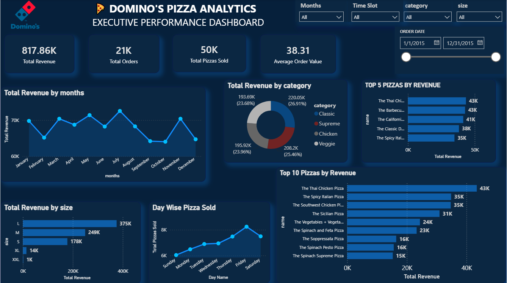

# 🍕 Pizza Sales Analytics Dashboard

> 🚀 An interactive **Power BI Dashboard** designed to analyze pizza sales performance, revenue trends, customer ordering patterns, and business insights.

---

# 📌 Project Overview

This Power BI project focuses on analyzing pizza sales data to uncover valuable business insights. The dashboard enables users to monitor revenue, customer orders, product performance, and sales trends through interactive visualizations, helping businesses make data-driven decisions.

---

# 🛠️ Tools & Technologies

- 📊 Microsoft Power BI
- ⚡ DAX (Data Analysis Expressions)
- 🔄 Power Query
- 🧩 Data Modeling
- 📈 Data Visualization

---

# 📊 Dashboard KPIs

- 💰 Total Revenue
- 🛒 Total Orders
- 🍕 Total Pizzas Sold
- 💵 Average Order Value

---

# 📈 Dashboard Features

- 📅 Monthly Revenue Trend
- 🍕 Top 5 Pizzas by Revenue
- 🥇 Top 10 Pizzas by Revenue
- 🍽️ Revenue by Pizza Category
- 📏 Revenue by Pizza Size
- 📆 Day-wise Pizza Sales
- 🎛️ Interactive Slicers & Filters

---

# 🎛️ Interactive Filters

- 📅 Order Date
- 🗓️ Month
- ⏰ Time Slot
- 🍕 Pizza Category
- 📏 Pizza Size

---

# 📷 Dashboard Preview

---

# 💡 Key Business Insights

- 💰 Track total revenue and customer orders.
- 📈 Analyze monthly revenue trends.
- 🍕 Identify the best-performing pizzas by revenue.
- 🍽️ Compare revenue across different pizza categories.
- 📏 Understand customer preferences by pizza size.
- 📆 Monitor sales performance across different days of the week.

---

# 🚀 Skills Demonstrated

- ✅ Data Cleaning
- ✅ Data Modeling
- ✅ DAX Measures
- ✅ Power Query
- ✅ Dashboard Design
- ✅ Business Intelligence
- ✅ Data Visualization
- ✅ Sales Performance Analysis

---

# 📂 Repository Contents

- 📄 Pizza Sales Analytics Dashboard.pbix
- 🖼️ Dashboard.png
- 📖 README.md

---

## 👨‍💻 Author

**Bhavesh Jain**
