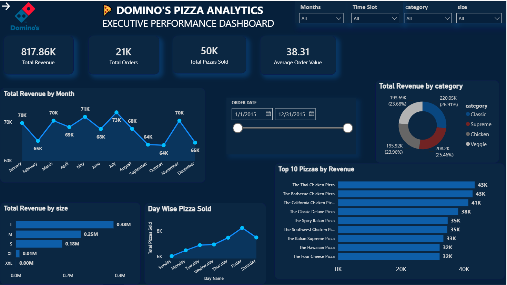
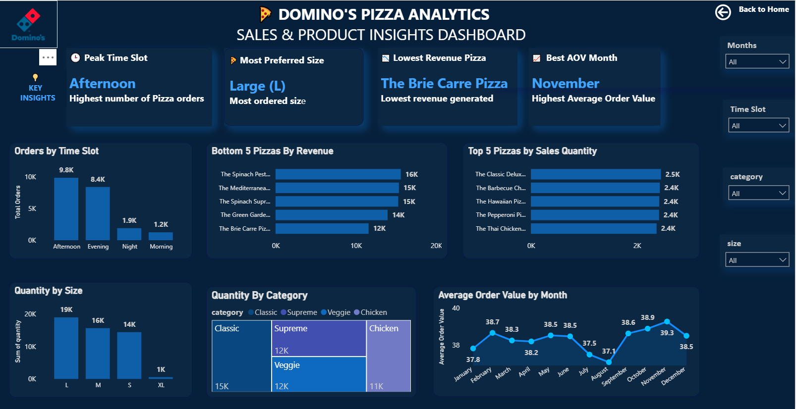

# 🍕 Pizza Sales Analytics Dashboard

> 🚀 An interactive **Power BI Dashboard** built to analyze pizza sales performance, revenue trends, customer purchasing behavior, and business insights through interactive visualizations.

---

# 📌 Project Overview

The **Pizza Sales Analytics Dashboard** is a Business Intelligence project developed in **Microsoft Power BI** to transform raw pizza sales data into meaningful insights. The dashboard provides an overview of overall business performance, identifies best-selling products, analyzes customer ordering patterns, and helps stakeholders make informed business decisions.

---

# 🛠️ Tools & Technologies

- 📊 Microsoft Power BI
- ⚡ DAX (Data Analysis Expressions)
- 🔄 Power Query
- 🧩 Data Modeling
- 📈 Data Visualization

---

# 📊 Dashboard KPIs

- 💰 Total Revenue
- 🛒 Total Orders
- 🍕 Total Pizzas Sold
- 💵 Average Order Value

---

# 📈 Dashboard Features

### 📄 Executive Dashboard

- 💰 Total Revenue Overview
- 🛒 Total Orders Analysis
- 🍕 Total Pizzas Sold
- 💵 Average Order Value
- 📈 Monthly Revenue Trend
- 🍽️ Revenue by Pizza Category
- 📏 Revenue by Pizza Size
- 📅 Day-wise Pizza Sales
- 🎛️ Interactive Filters

### 📄 Sales Performance Dashboard

- 🥇 Top 10 Pizzas by Revenue
- 📉 Bottom 10 Pizzas by Revenue
- 🍕 Quantity Sold by Pizza Category
- 📏 Quantity Sold by Pizza Size
- ⏰ Orders by Hour (Time Slot)
- 📆 Average Order Value by Month
- 🍕 Top 10 Pizzas by Quantity Sold

---

# 🎛️ Interactive Filters

- 📅 Order Date
- 📆 Month
- 🍕 Pizza Category
- 📏 Pizza Size

---

# 📷 Dashboard Preview

## 📄 Executive Dashboard



## 📄 Sales Performance Dashboard



---

# 💡 Key Business Insights

- 💰 Monitor overall business revenue and order performance.
- 📈 Analyze monthly sales trends to identify seasonal demand.
- 🍕 Discover the highest and lowest revenue-generating pizzas.
- 🍽️ Compare sales across different pizza categories.
- 📏 Understand customer preferences based on pizza size.
- ⏰ Identify peak ordering hours for better operational planning.
- 📆 Track average order value over different months.

---

# 🚀 Skills Demonstrated

- ✅ Data Cleaning
- ✅ Power Query
- ✅ Data Modeling
- ✅ DAX Measures
- ✅ Dashboard Design
- ✅ Interactive Reporting
- ✅ Business Intelligence
- ✅ Sales Performance Analysis
- ✅ Data Visualization

---

# 📂 Repository Contents

```
Pizza-Sales-Analytics/
│
├── Pizza Sales Dashboard.pbix
├── Pizza Sales Dataset.xlsx
├── Dashboard1.png
├── Dashboard2.png
└── README.md
```

---

# 🎯 Business Value

This dashboard enables businesses to:

- 📊 Monitor sales performance in real time.
- 💰 Track revenue growth and customer ordering behavior.
- 🍕 Identify top-performing and low-performing products.
- 📈 Improve inventory planning based on demand.
- 🎯 Support data-driven business decisions through interactive reporting.

---

## 👨‍💻 Author

**Bhavesh Jain**

🎓 B.Tech Computer Science Engineering

💻 Aspiring Data Analyst | Power BI | SQL | Python | Excel

⭐ If you found this project useful, don't forget to **Star ⭐ the repository!**
